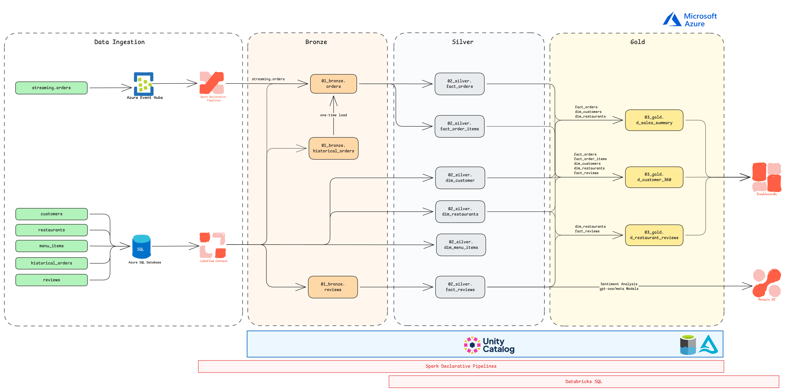
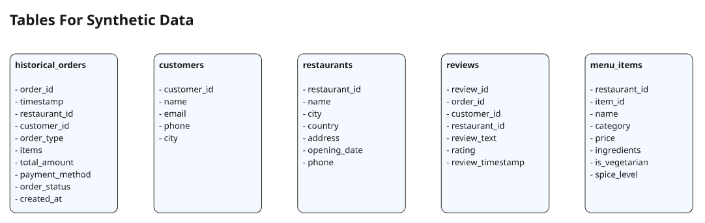

# Restaurant Analytics Platform

An end-to-end **Databricks Lakehouse** project that models a fictional restaurant chain's data - orders, customers, restaurants, menu items, and reviews - through a full **medallion architecture** (Bronze → Silver → Gold) on Azure, with sentiment analysis powered by Databricks Mosaic AI.

## Architecture



**Data Ingestion**
- Real-time order events stream in via **Azure Event Hubs**
- Batch dimensional data (`customers`, `restaurants`, `menu_items`, `historical_orders`, `reviews`) is sourced from an **Azure SQL Database** via **Lakeflow Connect**
- Both paths are ingested using **Spark Declarative Pipelines (SDP)**

**Bronze Layer** - raw, ingested-as-is data
- `01_bronze.orders` (streaming + one-time historical backfill)
- `01_bronze.historical_orders`
- `01_bronze.reviews`

**Silver Layer** - cleaned, conformed, modeled data
- `02_silver.fact_orders`
- `02_silver.fact_order_items`
- `02_silver.dim_customer`
- `02_silver.dim_restaurants`
- `02_silver.dim_menu_items`
- `02_silver.fact_reviews`

**Gold Layer** - business-ready, aggregated tables
- `03_gold.d_sales_summary`
- `03_gold.d_customer_360`
- `03_gold.d_restaurant_reviews`

Gold tables feed BI dashboards directly, and review text is additionally routed to **Mosaic AI** (gpt-oss / Meta models) for sentiment analysis. The entire pipeline is governed by **Unity Catalog** and queried through **Databricks SQL**.

## Repository Structure

```
Restaurant_Analytics/
├── 00_synthetic_data/          # Scripts + data to simulate the source systems
│   ├── 00_sql_db.py             # Provisions/loads the Azure SQL Database tables
│   ├── 01_historical_orders.py  # Generates historical order data
│   ├── 02_reviews.py            # Generates synthetic customer reviews
│   ├── 03_run.py                # Orchestrates the synthetic data generation
│   ├── 04_eventhub_orders.py    # Streams synthetic live orders to Event Hubs
│   ├── data/                    # Generated CSVs (customers, restaurants, menu_items, etc.)
│   ├── sql/                     # DDL, schema references, and utility SQL scripts
│   └── README.md
├── 01_pipelines/
│   ├── pipeline_ingest_eventhub.py       # Ingests streaming orders from Event Hubs
│   └── pipeline_bronze_to_gold/
│       ├── silver/                       # Bronze → Silver transformation logic
│       │   ├── fact_orders.py
│       │   ├── fact_order_items.py
│       │   └── fact_reviews.sql
│       └── gold/                         # Silver → Gold aggregation logic
│           ├── d_sales_summary.py
│           ├── d_customer_360.py
│           └── d_restaurant_reviews.py
├── diagrams/                   # Architecture and data model diagrams
├── dashboard_metrics.md        # Metric definitions for the BI dashboards
├── commands_used.md            # Ad-hoc SQL/Bash commands used during development
└── README.md
requirements.txt
```

## Dashboards

Two dashboards are built on top of the Gold layer:

**Restaurant Chain Performance Dashboard** *(filterable by date range)*
- Total Orders, Total Revenue, Active Customers, AOV, Unique Customers
- Daily Sales, Best Selling Items
- Order Volume by Day of Week
- Peak Hour Analysis (heatmap)
- Revenue by Order Type / Food Category

**Review Insights Dashboard** *(filterable by restaurant name)*
- Review Volume over time, Average Rating, City
- Positive / Neutral / Negative review counts and sentiment trend
- Ratings Distribution
- Issue Categorization (Delivery, Food Quality, Pricing, Portion Size)
- Recent Review Feed

See [`dashboard_metrics.md`](Restaurant_Analytics/dashboard_metrics.md) for the full metric list.

## Synthetic Data Model



Five core entities are synthetically generated: `historical_orders`, `customers`, `restaurants`, `reviews`, and `menu_items`.

## Tech Stack

- **Compute / Orchestration**: Databricks, Spark Declarative Pipelines
- **Streaming**: Azure Event Hubs
- **Source Database**: Azure SQL Database
- **Ingestion**: Lakeflow Connect
- **Governance**: Unity Catalog
- **Querying / BI**: Databricks SQL, Dashboards
- **AI/ML**: Mosaic AI (gpt-oss / Meta models) for review sentiment analysis
- **Language**: Python, SQL

## Getting Started

1. Install dependencies:
   ```bash
   pip install -r requirements.txt
   ```
2. Generate synthetic source data (see `Restaurant_Analytics/00_synthetic_data/`):
   ```bash
   python 00_synthetic_data/03_run.py
   ```
3. Deploy the Bronze → Silver → Gold pipelines in `Restaurant_Analytics/01_pipelines/` to your Databricks workspace.
4. Refer to `Restaurant_Analytics/commands_used.md` for common ad-hoc commands (e.g., updating Lakeflow Connect ingestion gateway policies, inspecting the SDP event log).

## Acknowledgements

This project is sourced from the Databricks Masterclass repository:
**[afaqueahmad7117/databricks-masterclass - databricks-e2e-project](https://github.com/afaqueahmad7117/databricks-masterclass/tree/main/projects/databricks-e2e-project)**
